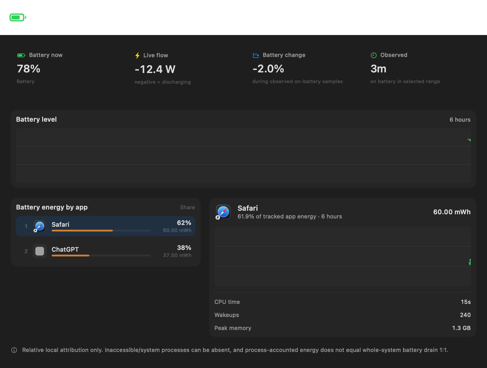

<div align="center">

# ☀️ Helios

**Native Apple Silicon system telemetry, energy insight, and carefully gated fan control for macOS.**


Helios is a lightweight native menu-bar utility that brings deep hardware telemetry, persistent history, per-app energy/process insight, and a safety-first cooling interface into one macOS app.

**Current status:** engineering release-candidate / external-beta source preview. No public binary, DMG, updater, or notarized release is published yet.

</div>

<p align="center">
  
</p>

## Why Helios

Most Mac monitoring tools specialize in one area. Helios is designed as one native utility for the information that is useful during normal daily use, troubleshooting, development, and hardware diagnostics — without turning the privileged helper into a general-purpose root service.

The unprivileged app owns telemetry and presentation. The privileged helper exists only for validated fan writes and is intentionally isolated from battery, storage, cleanup, process, networking, and other monitoring features.

## Highlights

| Area | What Helios provides |
| --- | --- |
| **CPU & Memory** | Aggregate and per-core CPU activity, topology, load, memory composition, pressure, swap, and persistent history |
| **GPU & Thermals** | GPU utilization where exposed by macOS/IOKit, trusted thermal zones, advisory raw sensor inventory, thermal state |
| **Battery & Power** | System-normalized SoC, health/capacity/cycles, battery flow, charger/adapter diagnostics, time remaining, system-power telemetry |
| **Storage & NVMe** | Physical storage inventory, throughput, IOPS, volumes, native read-only NVMe SMART, lifetime counters where available |
| **Processes & Energy** | CPU, memory, wakeups, disk I/O, process energy counters, session leaders, bounded per-app energy history |
| **Network & Wi-Fi** | Primary/active interfaces, addresses, routes, DNS, throughput, errors, Wi-Fi signal/radio/security diagnostics |
| **Devices & System** | Displays, USB, Bluetooth, audio, mounted volumes, sleep blockers, clocks, installed-app inventory, capability report |
| **History & Health** | Live graphs, bounded persistent telemetry, I/O audit, health transitions, optional notifications and CSV exports |
| **Cooling** | System, Boost, Manual, and Automatic Rules behind a separately authenticated fan-only helper and strict write gate |
| **Maintenance** | Read-only Cleanup Scout and inventory-style maintenance diagnostics; no destructive cleanup engine |

The current UI coverage gate verifies that **462 stored/derived telemetry fields remain reachable** through the application.

## Interface

Helios uses native AppKit + SwiftUI surfaces rather than a web shell:

- configurable native menu-bar metric items,
- focused metric popovers,
- a fixed, module-driven Quick Dashboard,
- a sidebar-based Full Monitor,
- live and historical graphs,
- Battery & Energy views,
- Expert diagnostics,
- native Settings and onboarding presets.

<p align="center">
  
</p>

## Safety model

Fan control is deliberately treated differently from read-only monitoring.

### Privileged helper

`HeliosDaemon` is **fan-only**. It does not provide privileged battery control, process inspection, storage modification, cleanup, or unrelated system administration.

The fan path includes authenticated XPC, ownership/lease handling, recovery journaling, stale-data rejection, explicit System fallback, disconnect restoration, and an independent emergency cooling guard.

### Hardware write boundary

Read-only telemetry is designed to degrade by capability across Apple Silicon Macs. **Fan writes are not generalized from that compatibility claim.**

The currently validated production write profile remains pinned to:

- `Mac16,1`
- macOS build `25G83`
- base M4 14-inch MacBook Pro
- one validated physical fan

Other Apple Silicon Macs remain **System/read-only for fan control** unless a separate write profile is physically validated in the future.

Helios never invents missing fan ranges or writable SMC behavior.

### Battery boundary

Battery and charger information is read-only. Helios does **not** modify charging policy; macOS remains responsible for optimized charging and battery management.

See [Apple Silicon compatibility](docs/APPLE_SILICON_COMPATIBILITY.md) for the full compatibility contract.

## Platform support

| | Current contract |
| --- | --- |
| **CPU architecture** | Apple Silicon / `arm64` only |
| **Deployment target** | macOS 13.0+ |
| **Primary validation host** | base M4 14-inch MacBook Pro (`Mac16,1`) |
| **Read-only telemetry** | capability-discovered; unavailable fields fail independently |
| **Fanless Macs** | valid telemetry-only targets |
| **Multi-fan Macs** | represented dynamically for read-only telemetry |
| **Fan writes** | exact validated profile only; otherwise System/read-only |

M1/M2/M3/M5-class hardware, fanless Macs, desktops, and multi-fan Macs are architectural compatibility targets, **not claims of physical validation** unless specifically tested.

## Validation snapshot

The current engineering candidate passes the project's full native regression/Xcode gate on the primary M4 host, including telemetry, presentation, persistence, XPC, fan safety simulations, capability fallbacks, Swift 6 strict concurrency, and the 462-field UI coverage check.

Latest comparable closed-UI Release captures on that host:

| Preset | Helios CPU time |
| --- | ---: |
| Simple | **14.52 ms/s** |
| Recommended | **17.31 ms/s** |
| Detailed | **21.49 ms/s** |

A 15-minute Recommended/System Release soak completed without process restart; the final physical footprint was **22.53 MiB**. A separate three-cycle interactive UI stress test settled at **+15.0 MiB physical footprint vs. its warm baseline** rather than growing monotonically across cycles.

These are **host-specific engineering measurements**, not universal performance guarantees.

For methodology and current release blockers, see [Release readiness](docs/RELEASE_READINESS.md).

## Architecture

```text
┌──────────────────────────────────────────────────────────┐
│ Helios.app — unprivileged                                │
│                                                          │
│ AppKit menu bar + SwiftUI UI                             │
│ Shared telemetry/history model                          │
│ CPU / Memory / GPU / Battery / Storage / Network / ...  │
└───────────────────────────┬──────────────────────────────┘
                            │ authenticated XPC
                            │ fan control only
┌───────────────────────────▼──────────────────────────────┐
│ HeliosDaemon — privileged                               │
│ fan ownership / lease / recovery / validated SMC writes│
└──────────────────────────────────────────────────────────┘
```

Repository layout:

| Path | Responsibility |
| --- | --- |
| `Sources/HeliosApp` | App lifecycle, menu bar, dashboard, Full Monitor, Settings, cooling presentation |
| `Sources/HeliosApp/Telemetry` | Unprivileged telemetry providers, models, history, persistence, health evaluation |
| `Sources/HeliosDaemon` | Authenticated fan-only privileged helper and recovery logic |
| `Sources/Shared` | Shared fan models, SMC read transport, XPC protocol and trust requirements |
| `Tests` | Native regression fixtures for telemetry, UI, persistence, XPC and fan safety |
| `scripts` | Build, regression, presentation, performance and memory validation tooling |
| `docs` | Compatibility, architecture history, performance and release-readiness notes |

No third-party package manager or runtime dependency is required by the application.

## Build from source

> Helios is currently a **source preview**, not a frictionless end-user download.

Requirements:

- Apple Silicon Mac
- macOS 13+
- a current Xcode capable of building Swift 6 code
- an Apple Development signing identity if you want the authenticated privileged helper to connect

### 1. Configure your local signing team

The public repository does not need to contain a developer-specific Team ID. Create the ignored local override:

```sh
cp Config/Local.xcconfig.example Config/Local.xcconfig
```

Then edit `Config/Local.xcconfig` and replace `YOUR_TEAM_ID` with your Apple Development Team ID.

Both the app and helper must use the same valid signing team because Helios authenticates its XPC peer instead of accepting arbitrary local clients.

### 2. Build

Open `Helios.xcodeproj`, choose the shared **HeliosApp** scheme and build normally, or use:

```sh
xcodebuild \
  -project Helios.xcodeproj \
  -scheme HeliosApp \
  -configuration Debug \
  -destination 'platform=macOS,arch=arm64' \
  -derivedDataPath .build/DerivedData \
  build
```

For an optimized local build use `-configuration Release`.

The built app is placed under:

```text
.build/DerivedData/Build/Products/<configuration>/Helios.app
```

### 3. Run the validation gate

```sh
./scripts/check-all.sh
```

The canonical successful final line is:

```text
PASS full Helios regression gate and Xcode build
```

The helper trust model intentionally rejects debugger/injection exception entitlements. For a signed helper-connected run, launch the built app directly or disable **Debug executable** in the Xcode scheme when appropriate.

More detail: [Building Helios](docs/BUILDING.md).

## Downloads

There is currently **no public `.dmg`, `.pkg`, or notarized `.app`**.

A proper public binary release still needs:

1. Developer ID Application signing for the app and helper,
2. hardened-runtime distribution validation,
3. Apple notarization,
4. stapling,
5. clean-machine install/helper validation,
6. packaging (likely DMG) and release automation.

The project will not recommend bypassing Gatekeeper as a substitute for proper distribution signing.

## Privacy

Helios is designed around local, native telemetry. Monitoring and history stay local to the Mac. The privileged helper is deliberately restricted to the fan-control path.

Some system information can be unavailable because macOS permissions or hardware interfaces do not expose it. Helios prefers an explicit unavailable/partial state over escalating privileges or fabricating data.

## Project status / roadmap

Current focus is release engineering rather than adding large new features.

Near-term priorities:

- physical read-only smoke testing on more Apple Silicon generations and device classes,
- choosing the source license,
- Developer ID signing and notarization,
- a clean downloadable package,
- external-beta feedback and compatibility fixes.

Longer-term ideas live in [ROADMAP.md](docs/ROADMAP.md).

## License

**No project license has been selected yet.**

Until a `LICENSE` file is added, this repository should be treated as **source-visible for evaluation**, not as granting a general license to copy, modify, redistribute, or incorporate the code into other projects.

A license will be selected before Helios is presented as an open-source release.

## Disclaimer

Helios is independent software and is not affiliated with or endorsed by Apple Inc. Hardware telemetry may depend on undocumented or version-specific interfaces. Custom fan control can override macOS fan targets on explicitly supported hardware; **System** remains the recommended cooling mode.
