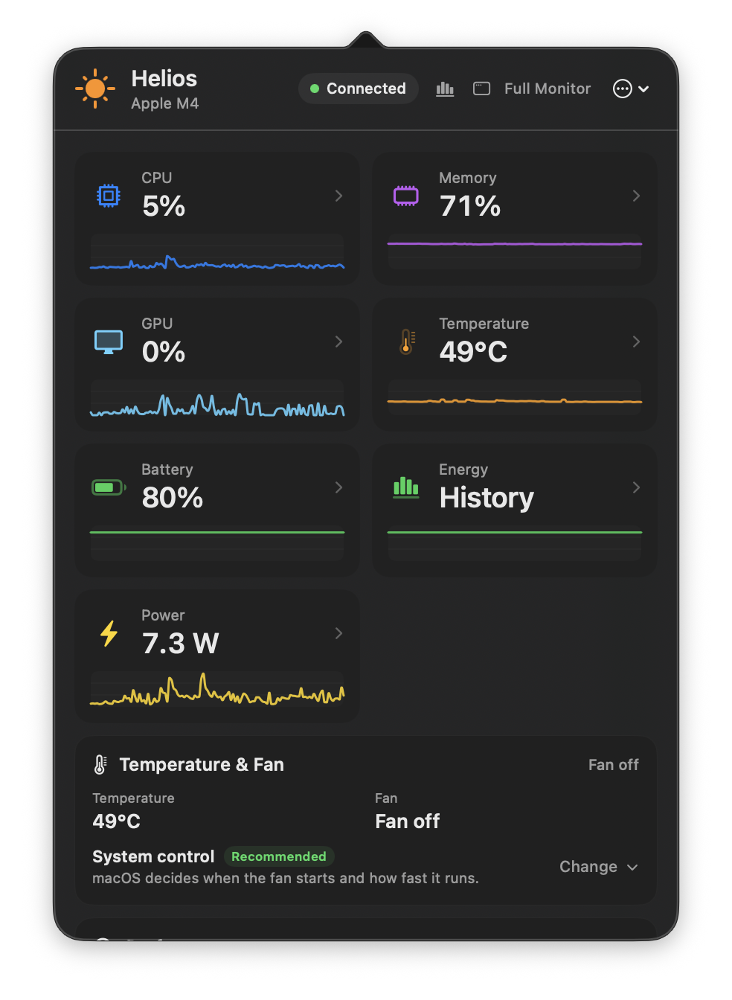
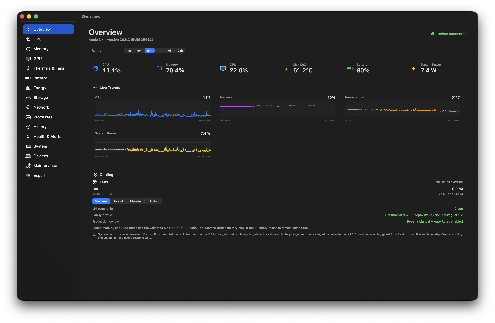
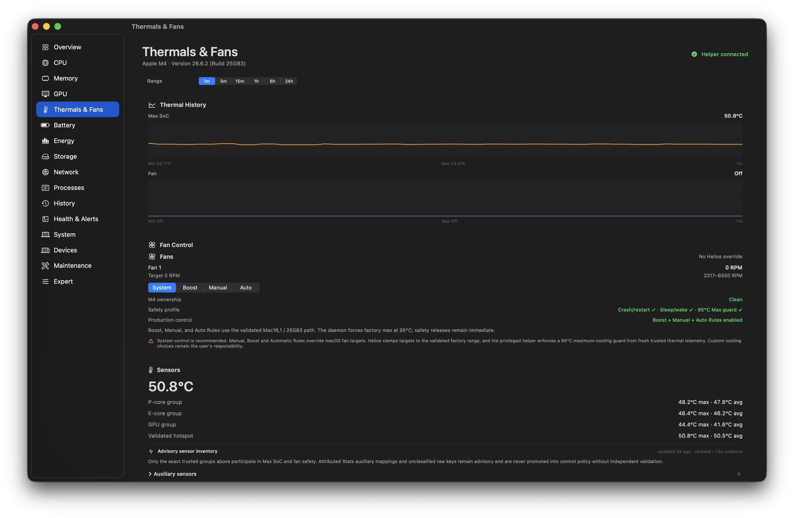
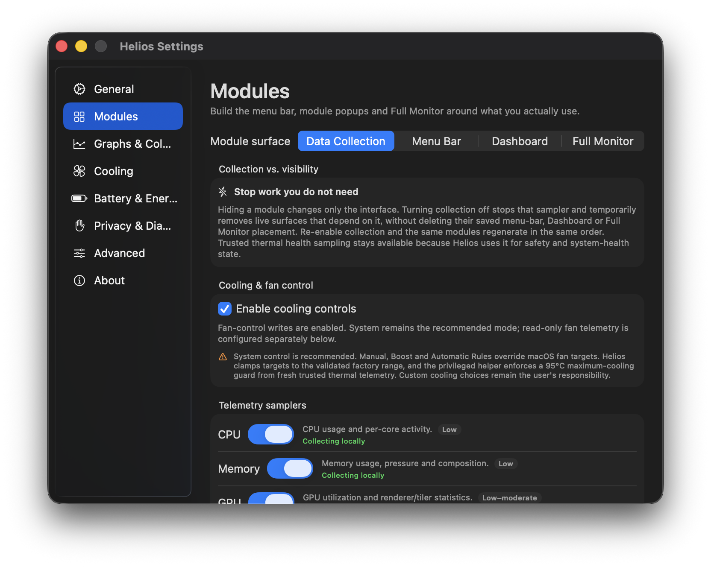
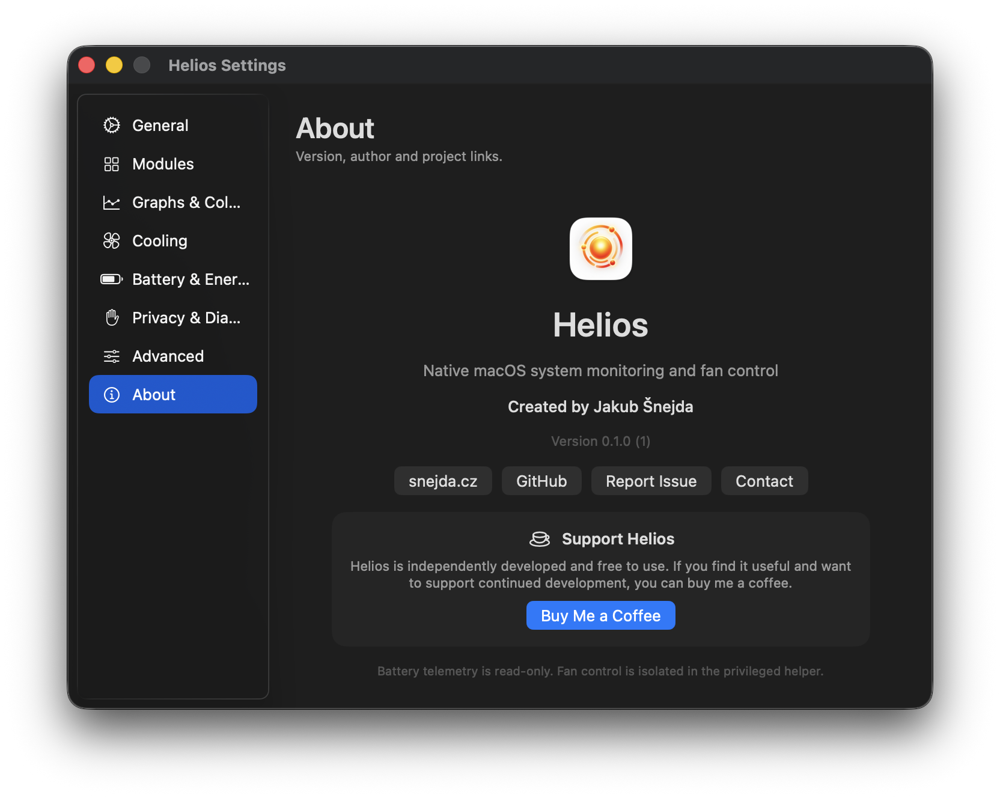

<div align="center">


# Helios

**Know what your Mac is doing.**

Native menu-bar monitoring for Apple Silicon: system activity, temperatures,
battery and energy history, with carefully gated fan controls.

**[⬇ Download Helios 0.1.0 Pre-beta 1](https://github.com/Snejdik/helios/releases/tag/v0.1.0-prebeta.1)**


[](LICENSE)

[Installation guide](docs/INSTALLATION.md) · [Build from source](docs/BUILDING.md) ·
[Report a bug](https://github.com/Snejdik/helios/issues) ·
[Buy Me a Coffee](https://buymeacoffee.com/snejda)

</div>

Helios puts a quick Dashboard in your menu bar and a larger Full Monitor one
click away. Use it to understand resource use, inspect hardware capabilities,
and follow changes over time without keeping a large monitoring window open.

**Pre-beta development build / source preview.**
Helios is an **external testing build**, not a finished public release or
notarized public distribution. The support matrix is still being established;
not every Apple Silicon Mac has been validated. Successful compilation or
working telemetry does **not** establish fan-write compatibility. See the
[beta checklist](docs/PRE_BETA_CHECKLIST.md) and
[release-readiness record](docs/RELEASE_READINESS.md).

## What Helios can do today

| Area | Available functionality |
| --- | --- |
| Menu bar & Dashboard | Configurable metric items, focused popovers, Dashboard presets and live graphs |
| Full Monitor | Native sidebar navigation, detailed monitoring views and Expert diagnostics |
| CPU, memory & GPU | Aggregate/per-core CPU activity, memory pressure and composition, swap, GPU activity where available |
| Thermals & fans | Temperature groups, fan readouts and System mode; Boost, Manual and Automatic Rules require an authenticated helper and an exact validated hardware profile |
| Battery & energy | Charge, health, cycles, charger information, battery flow, system power where exposed and energy history |
| Processes | Per-process CPU, memory and I/O, plus per-app energy attribution where macOS exposes it |
| Storage & network | Volumes, throughput, read-only NVMe SMART where available, interface and Wi-Fi diagnostics |
| Devices & utilities | Device/system inventories, sleep blockers and read-only Cleanup Scout; no destructive cleanup engine |
| History & alerts | Bounded local history, health events, optional notifications and CSV exports |
| Settings & support | Onboarding, interface/module preferences, launch at login, optional diagnostics with previews, built-in preparation for removal |

**Hardware dependent:** GPU counters, temperature sensors, system power, NVMe
SMART, Wi-Fi details and process energy depend on the Mac, macOS and permissions.
An unavailable reading is not a zero reading. Battery charging policy remains controlled by macOS.

## A look inside

Live captures from the current pre-beta working tree on the primary M4 MacBook
Pro, 12 September 2026. These illustrate the interface, not universal hardware
compatibility. Select an image to inspect its original resolution.
[Capture details and secondary views](docs/images/README.md).

### Quick Dashboard

Your essential readings in one menu-bar panel, with the simple Helios sun and
**System control** recommended.

<a href="docs/images/dashboard-dark.png"></a>

### Full Monitor

A larger workspace for live trends, hardware details and history.

<a href="docs/images/full-monitor-overview-dark.png"></a>

<details>
<summary><strong>Thermals &amp; Fans — System mode</strong></summary>

macOS manages the fan in System mode. The additional controls shown here are
specific to this validated machine; they are not a recommendation to enable Auto.

<a href="docs/images/thermals-fans-system-dark.png"></a>

</details>

<details>
<summary><strong>Settings — choose your modules</strong></summary>

Choose what Helios collects and which modules appear in each interface.

<a href="docs/images/settings-modules-dark.png"></a>

</details>

<details>
<summary><strong>About Helios</strong></summary>

The official application icon, version and project links.

<a href="docs/images/about-dark.png"></a>

</details>

## Install a test build

Start with the [step-by-step installation guide](docs/INSTALLATION.md).
The recommended download is **Helios-0.1.0-prebeta.dmg** from
[GitHub Releases](https://github.com/Snejdik/helios/releases/tag/v0.1.0-prebeta.1).
Open the DMG, drag **Helios.app** to Applications, then eject the disk image.
Launch the Applications copy and look for Helios in the menu bar.
If you use a **ZIP** test build, extract it and copy **Helios.app** to Applications.

This build is **Apple Development signed and not notarized**, so you may need
**System Settings → Privacy & Security → Open Anyway** to launch it.

The guide covers macOS **Open Anyway**, optional helper approval, troubleshooting
and clean removal. Basic monitoring does not require the fan helper.

GitHub's **Code → Download ZIP** downloads source code, not an installable app.
To build from source, use the separate [developer build guide](docs/BUILDING.md)
or ask [support](mailto:helios@snejda.cz).

## Compatibility & cooling safety

- **Apple Silicon (`arm64`) only; macOS 13.0+ is the deployment target.**
- Read-only telemetry adapts to available hardware capabilities; some readings may
  be unavailable. Compatibility requires independent testing across Macs and macOS versions.
- Fan control is enabled only for specifically validated hardware and OS profiles.
  Unvalidated profiles remain **System/read-only**.
- **System is the recommended cooling mode.** Successful monitoring or helper
  installation does not establish fan-control support.

The privileged helper is fan-only, with authentication and thermal safety
checks; it is not a general-purpose root service. Battery charging policy remains
controlled by macOS.
See the [compatibility contract](docs/APPLE_SILICON_COMPATIBILITY.md) for exact
validated profiles, [release-readiness record](docs/RELEASE_READINESS.md) for
host-specific evidence, and [security information](https://www.snejda.cz/helios/security)
for the protection boundaries.

## Privacy

Monitoring history is stored locally. **Automatic beta diagnostics are off by
default** and can be enabled in Settings → Privacy & Diagnostics. Manual health
and compatibility reports require a preview and a separate Send confirmation;
they do not turn on automatic sharing. These optional reports use the project's
HTTPS diagnostics endpoint, so “local monitoring” does not mean “never uses the network.”

The app provides **View exactly what is shared**. Review reports before sending,
and check screenshots or exported diagnostics for personal information before
attaching them publicly. Microphone access is not requested for audio inventory;
Bluetooth information and some other fields may be restricted by macOS.

[Privacy information](https://www.snejda.cz/helios/privacy) ·
[Diagnostics information](https://www.snejda.cz/helios/diagnostics) ·
[Diagnostics design and constraints](docs/BETA_DIAGNOSTICS.md)

## Bugs, questions & support

[Open a GitHub issue](https://github.com/Snejdik/helios/issues/new/choose) for a
reproducible bug. Include your Helios version (Settings → About), Mac model,
chip, macOS version, exact steps, expected result, what actually happened and a
reviewed screenshot. Include the build number shown in About when available. Mention
whether the problem is monitoring, first launch or helper connection. Never
post credentials, serial numbers, unreviewed diagnostic reports or sensitive
screenshots publicly.

If GitHub shows a 404 or you do not have repository access, use email instead.
For private questions or security-sensitive reports, contact
[helios@snejda.cz](mailto:helios@snejda.cz) instead of posting public details.
See the [tester checklist](docs/PRE_BETA_CHECKLIST.md) for useful checks.

Helios is independently developed by Jakub Šnejda. If it helps you,
[Buy Me a Coffee](https://buymeacoffee.com/snejda) supports continued development.
This is the same support link included in Settings → About.

## ROADMAP / PLANNED — not implemented

The following are future product directions, **not available features** and not
promises for the first beta. No delivery dates are committed.

- LinearMouse-style mouse controls and customization.
- Keep Awake.
- Drag-and-drop utilities and workflows.
- Clipboard / copy-paste history and tools.
- Future unified Mac utility modules.

The immediate priority is beta validation, compatibility, signing, notarization,
packaging and distribution. See the
[roadmap](docs/ROADMAP.md) for the distinction between current functionality,
release preparation and future ideas.

## For developers

[Building Helios](docs/BUILDING.md) covers cloning, Xcode, local signing,
build/run commands and the full regression gate. The app uses Swift 6, AppKit,
SwiftUI and native frameworks without third-party runtime packages.

`Sources/HeliosApp` contains the app and telemetry; `Sources/HeliosDaemon` holds
the fan-only helper; `Sources/Shared` contains shared models and trust contracts.
Changes must preserve the frozen backend boundary. The canonical check is:

```sh
./scripts/check-all.sh
```

Historical host-specific performance measurements and their limits belong in
[Release readiness](docs/RELEASE_READINESS.md), not universal performance claims.

## License & notices

Helios original material is source-available under the
[PolyForm Noncommercial License 1.0.0](LICENSE). See the license for its terms;
commercial use requires separate permission from the project owner.
[Third-party notices](THIRD_PARTY_NOTICES.md), including the MIT-licensed Stats
mappings, retain their separate terms.

Helios is independent software and is not affiliated with or endorsed by Apple.
Hardware telemetry can depend on undocumented or macOS-version-specific interfaces.
