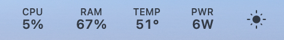

# Install Helios — guide for first-time testers

You do not need Terminal or Xcode to install an app supplied by the maintainer.
These instructions describe the existing test-app flow, not an already published
installer. A public packaged, notarized binary is still pending.

## 1. Check your Mac

Choose **Apple menu → About This Mac**. You need an **Apple Silicon** chip (an
Apple M-series chip) and **macOS 13 or later**. Intel Macs are not supported.
The minimum macOS version is a build target, not proof that every supported
version or Mac model has been tested. Most testing is on the base M4 MacBook Pro.

## 2. Download the app

Use the test-build link supplied directly by the Helios maintainer. If you have
no link, ask [helios@snejda.cz](mailto:helios@snejda.cz). Do not look for a guessed
DMG filename. GitHub's **Code → Download ZIP** contains developer source files,
not an app you can double-click.

## 3. Copy the supplied app to Applications

If another Helios is already installed, follow [Reinstall or replace a test
build](#reinstall-or-replace-a-test-build) first. Choose the flow matching the
file you received; a DMG is not yet promised as a current download.

### If your test build is supplied as a ZIP

1. Download the supplied test-build ZIP and find it in **Finder → Downloads**.
2. Double-click the ZIP to extract it.
3. Find **Helios.app** in the extracted contents (Finder may show just **Helios**).
4. Drag or copy **Helios.app** to **Applications** in Finder's sidebar. Wait for copying to finish.
5. Open **Applications** and launch **Helios** from there.

### If your test build is supplied as a DMG

1. Download the supplied **Helios.dmg** test package.
2. Double-click the DMG to open the disk image.
3. Drag **Helios** to **Applications**. Wait for copying to finish.
4. Eject the Helios disk image in Finder.
5. Open **Applications** and launch **Helios** from there.

Use only the Applications copy. Do not launch another copy from Downloads or
run the app from inside a mounted disk image.

## 4. First launch and Gatekeeper

macOS may ask whether you want to open an app downloaded from the Internet.
Confirm only if this is the build you obtained from the maintainer.

The repository uses local Apple Development signing; that is not a notarized
public distribution. A downloaded test build may therefore be blocked because
Apple cannot verify its developer or notarization. The exact wording varies by
macOS version and supplied artifact.

For a trusted test build, macOS offers a **per-app** exception:

1. Try opening Helios once, then dismiss the blocked-app message.
2. Open **Apple menu → System Settings → Privacy & Security**.
3. Scroll to the security area and find the message about Helios.
4. Click **Open Anyway**, authenticate if macOS asks, then confirm **Open**.
5. Launch Helios again from **Applications**.

This follows [Apple's current opening-app guidance](https://support.apple.com/102445).
**Open Anyway only permits the app to launch. It does not install or approve
the privileged helper**, and it does not sign or notarize Helios. If macOS
reports malware, a damaged app, or your organization blocks the exception, stop
and request a verified replacement or contact your administrator. Do not disable
Gatekeeper, remove quarantine through Terminal, or change system security settings.

## 5. Find Helios and finish setup

Helios is a **menu-bar app**: look at the top-right area of your screen for its
metric items. It normally has no Dock icon. Click a Helios metric to open its
popover or Dashboard, then choose **Full Monitor** to see detailed views.
Use the Dashboard's menu for **Settings**.

If Welcome Setup appears, choose an interface preset and finish the setup.
Optional diagnostics are your choice; monitoring does not require sharing them.
Leave cooling in **System** for ordinary beta testing.

To verify it is running, open the Dashboard and watch CPU or memory readings
update, then open Full Monitor. Some hardware fields may say unavailable; that
does not mean the entire app failed. Closing a window leaves menu-bar monitoring
running. Use Helios's **Quit Helios** command to stop the app.

## 6. Understand permissions and helper approval

| Prompt or setting | What to do |
| --- | --- |
| Bluetooth | Helios declares Bluetooth inventory access. macOS may request permission; declining can limit device information without preventing basic monitoring. |
| Notifications | Optional health alerts request notification permission after a user action. You can decline. |
| Launch at Login | Optional in Settings → General. It starts the app at login; it is separate from helper boot registration. |
| Share beta diagnostics | An in-app opt-in, off by default. Manual reports have a preview and separate Send confirmation. |
| Privileged helper | Needed for eligible fan control, not ordinary read-only monitoring. Installing or approving it does not make unsupported hardware writable. |

Helios does not request microphone permission merely to list audio devices.
Accessibility, Screen Recording and Full Disk Access are not basic installation
requirements; do not grant them just to make an unavailable sensor appear.

If you specifically need the helper for an eligible setup:

1. Open **Settings → Cooling** and find **Helper Service** in the privileged fan
   helper section.
2. Choose **Install Helper** if it is missing.
3. If the state is **Requires Approval**, choose **Open System Settings**.
4. In the Login Items / Login Items & Extensions pane opened by Helios, approve
   its background helper. macOS may ask for an administrator's authentication.
   Wording varies by macOS version.
5. Return to Helios and refresh helper status. **Installed ≠ Connected**:
   Installed is registration status; Connected is a separate authenticated
   connection status.

**Helper installation ≠ hardware authorization for fan writes.** Unvalidated
machines remain **System/read-only**, even with the helper installed.

A development build may show **Signing Required** or fail service registration.
Open Anyway cannot fix that. Ask the maintainer for a correctly signed test
build; do not replace signatures or manually install a root service.

## Common first-launch problems

| What you see | What to try |
| --- | --- |
| App blocked by macOS | For a trusted supplied build, follow the per-app Open Anyway steps above. |
| Signing Required | Ask the maintainer for a correctly signed build. Open Anyway cannot repair helper signing or trust. |
| No visible menu-bar item | Check whether Helios is running in Activity Monitor; a crowded/notched menu bar can hide items. Quit duplicate copies and relaunch the Applications copy. |
| No app window or Dock icon | Look for Helios metrics in the menu bar. Close other menu-bar menus; a crowded/notched menu bar can hide items. Check Activity Monitor for Helios if uncertain. |
| No running Helios process | Open the Applications copy again. Record any error and contact support if it immediately quits. |
| Two Helios copies | Quit both and launch only the Applications copy. |
| Unavailable / partial readings | Allow time for initial samples. Record the field, Mac model and macOS version; do not change permissions or fan settings indiscriminately. |
| Helper missing / disconnected | Monitoring can still work. Check Settings → Cooling and follow the approval instructions only if needed. |
| Reinstall Required | Use **Reinstall** in Helper Service for a protocol mismatch; wait for completion. If it fails, retain the error for support. |
| Open Anyway missing | First attempt to open the app, then return to Privacy & Security. Managed Macs may disallow exceptions; ask the administrator or maintainer. |
| Diagnostics send failed | Monitoring still works. Note the report status; do not repeatedly send or post the full payload publicly. |

For help, [open an issue](https://github.com/Snejdik/helios/issues/new/choose) or
email [helios@snejda.cz](mailto:helios@snejda.cz). Include the app version from
Settings → About, your Mac/chip and macOS version, and the exact error. Review
screenshots for private information first. If GitHub shows a 404 or requires
repository access you do not have, use the support email instead.

The [Energy Inspector empty-state example](images/energy-inspector-empty-dark.png)
shows what happens before on-battery history is available. It is not a send or
installation failure: allow Helios to observe normal battery use first.

## Remove Helios cleanly

Use the built-in preparation before dragging the app to Trash. Simply dragging Helios.app to Trash does **not** unregister its helper. Merely
quitting Helios does not unregister a helper configured to start at boot.

1. Open **Settings → Advanced → Removal**.
2. To keep your layout and monitoring history for a reinstall, leave **Erase local
   Helios settings and monitoring history** off. For a fresh start, turn it on;
   this removes the local preferences and `~/Library/Application Support/Helios`
   history and cannot be undone within Helios. Export anything you want first.
3. Click **Prepare Helios for Removal…**, read the confirmation and click **Prepare**.
   Helios requests System cooling, disables Launch at Login and unregisters its helper.
4. If removal reports an error, keep the app installed and resolve it with support.
   Do not manually remove daemon files or force the helper to stop.
5. With data retention selected, wait for the prepared-for-removal message, then
   quit Helios. With erasure selected, Helios quits automatically after preparation.
6. Move **Applications → Helios.app** to Trash. Helios never deletes its own app bundle.

The erasure flow removes app-managed preferences/history; it does not erase
exports you saved elsewhere, macOS logs, backups or reports already submitted.
It is not a secure-wipe guarantee. If Helios will not open, request help before
removing the app so the helper can be unregistered through the supported flow.

## Reinstall or replace a test build

Prepare removal as above. Keep the erasure option off to preserve settings, or
turn it on for a clean reinstall. Quit, move the old app to Trash, copy the new
app to Applications, and open it. Revisit helper approval if you need it. Do not
run the old and new copies together. No automatic updater is promised for this beta.
